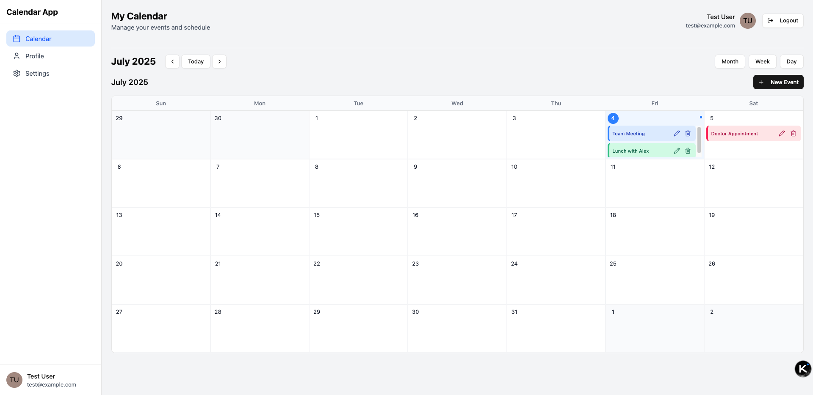

# A client Template for React Calendar Application

A modern, responsive calendar application built with React, Zustand, and React Query. This application helps users efficiently manage their schedules and events with an intuitive interface and robust functionality.



## Features

- 🔒 **User Authentication**: Secure login and registration
- 📅 **Event Management**: Create, view, update, and delete events
- 🎨 **Color-Coded Events**: Visual organization with color categories
- 📱 **Responsive Design**: Works seamlessly on desktop and mobile devices
- ⚡ **Optimized Performance**: Efficient state management and data fetching
- 🔄 **Real-time Updates**: Immediate UI feedback for all actions

## Technology Stack

### Core Technologies
- **Frontend**: React 18
- **State Management**: Zustand + React Query
- **Styling**: Tailwind CSS + shadcn/ui
- **Routing**: React Router 6
- **Build Tool**: Vite
- **Type System**: TypeScript

### Supporting Libraries
- **Date Handling**: date-fns
- **HTTP Client**: Axios
- **Icons**: Lucide React
- **Form Management**: React Hook Form
- **Validation**: Zod

## Getting Started

### Prerequisites
- Node.js 18+
- npm 9+ or yarn 1.22+

### Installation
1. Clone the repository:
```bash
git clone https://github.com/yourusername/calendar-app.git
cd calendar-app
```

2. Install dependencies:
```bash
npm install
```

3. Start the development server:
```bash
npm run dev
```

4. Start the mock API server (in a separate terminal):
```bash
npm run mock-server
```

5. Open your browser at [http://localhost:5173](http://localhost:5173)

### Test Account
- **Email**: test@example.com
- **Password**: password123

## Project Structure

```bash
src/
├── application/      # Application logic layer
│   ├── services/     # API services
│   ├── stores/       # Zustand state stores
│   └── view-models/  # React Query hooks
├── domain/           # Business domain models
│   └── entities/     # Core entities
├── infrastructure/   # Infrastructure layer
│   ├── api/          # API client
│   └── utils/        # Utility functions
├── presentation/     # UI components
│   ├── components/   # Reusable components
│   ├── features/     # Feature modules
│   ├── pages/        # Page components
│   └── layouts/      # Application layouts
├── App.tsx           # Application root
└── main.tsx          # Entry point
```

## Available Scripts

- `npm run dev`: Start development server
- `npm run build`: Create production build
- `npm run mock-server`: Start mock API server
- `npm run test`: Run unit tests
- `npm run lint`: Run code linter

## Key Architectural Decisions

### 1. Layered Architecture
The application follows a strict separation of concerns with four distinct layers:
- **Presentation**: UI components and rendering
- **Application**: Business logic and state management
- **Domain**: Core business entities and models
- **Infrastructure**: Technical implementations and utilities

### 2. State Management Strategy
- **UI State**: Managed with Zustand (current date, selected event, etc.)
- **Server State**: Managed with React Query (user data, event data)
- **Form State**: Managed with React Hook Form

### 3. Performance Optimization
- Efficient component rendering with React.memo
- Data caching with React Query
- Lazy loading for non-critical components
- Memoized selectors for Zustand stores

## API Reference

The application uses a mock API server that provides the following endpoints:

### Authentication
- `POST /auth/register`: Register new user
- `POST /auth/login`: Authenticate user
- `GET /auth/me`: Get current user info

### Calendar Events
- `GET /events`: Get all events
- `POST /events`: Create new event
- `PUT /events/:id`: Update existing event
- `DELETE /events/:id`: Delete event

## Contributing

We welcome contributions! Please follow these steps:
1. Fork the repository
2. Create a new branch (`git checkout -b feature/your-feature`)
3. Commit your changes (`git commit -am 'Add some feature'`)
4. Push to the branch (`git push origin feature/your-feature`)
5. Open a pull request

## License

This project is licensed under the MIT License - see the [LICENSE](LICENSE) file for details.

## Documentation

For comprehensive documentation including architecture diagrams, API details, and development guides, visit our [documentation site](https://your-docs-site.com).

---

**React Calendar Application** © 2023. Designed and built with modern web technologies.