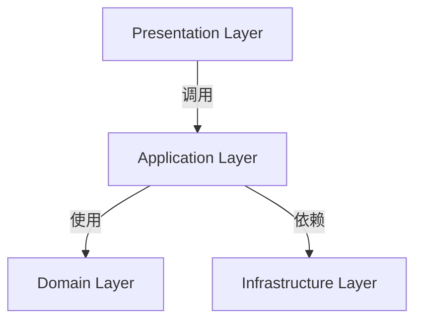
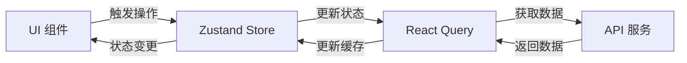

# 5. 技术架构 

## 技术架构

日历应用采用分层架构设计，确保关注点分离和代码可维护性。

## 架构图

## 分层架构
### 展示层 (Presentation)
- **职责**：处理 UI 渲染和用户交互
- **技术**：
1. React 组件
2. shadcn/ui 组件库
3. Tailwind CSS 样式
- **目录**：src/presentation/

### 应用层 (Application)
- **职责**：协调领域逻辑和基础设施
- **技术**：
1. Zustand 状态管理
2. React Query 数据获取
3. 自定义 Hooks
- **目录**：src/application/

### 领域层 (Domain)
- **职责**：定义核心业务模型
- **内容**：
1. 用户模型
2. 日历事件模型
3. 业务规则
- **目录**：src/domain/

### 基础设施层 (Infrastructure)
- **职责**：提供技术实现细节
- **内容**：
1. API 客户端
2. 日期工具
3. 本地存储适配器
- **目录**：src/infrastructure/

## 状态管理

### 状态管理策略
- **UI 状态**：使用 Zustand 管理（当前日期、选中事件等）
- **服务端状态**：使用 React Query 管理（用户数据、事件数据）
- **表单状态**：使用 React Hook Form 管理

### 数据流
- 组件触发动作（如创建事件）
- 调用应用层服务
- 服务层与基础设施层通信（API 调用）

### 更新状态存储
- 状态变更触发 UI 更新

